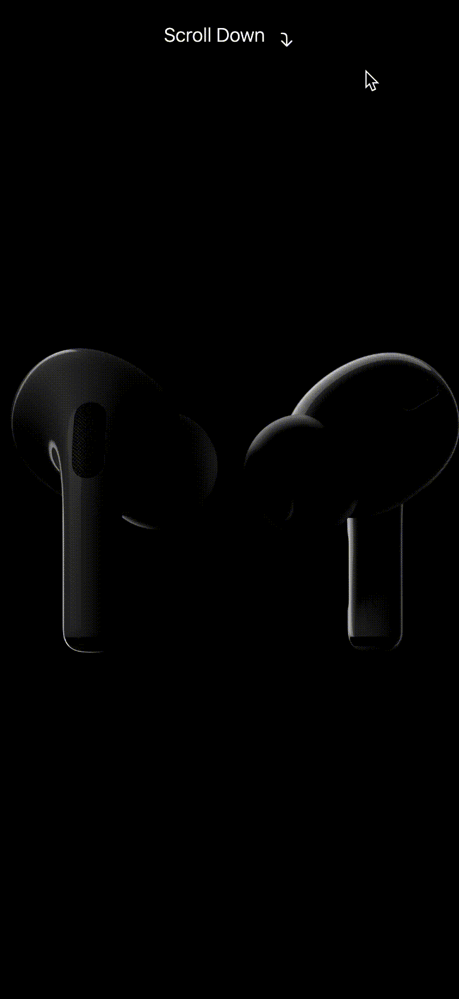

# Apple scroll animation

This is a vanilla Javascript way of doing the "sync video/image frame to scroll" animation often found on _Apple_ website.

> Note: As a second apple-like effect, an element will be shown when the user scrolls to the bottom of the page.

## Demo

[Check it out here](https://emanuelefavero.github.io/apple-scroll-animation/)

#### GIF example

> Note: The gif is not a real-time representation of the animation
